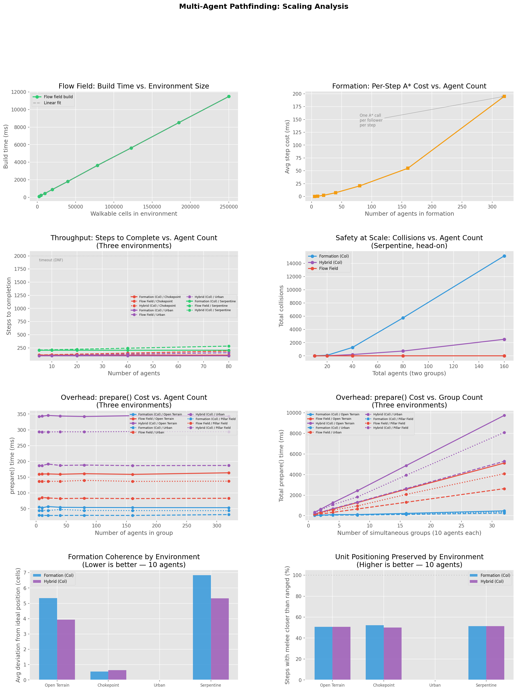

# Pathfinding for Multiple Agents in 3D Environments
**Daymian Snowden — CS 5100: Foundations of AI — April 15, 2026**

---

## 1. Introduction and Background

The challenge of Multi-Agent Pathfinding (MAPF) in constrained environments is a core problem in AI. Computing paths for multiple agents while they perform tasks and avoid collisions in the same shared environment is challenging. Thankfully, our question is much more narrow in scope, but related.

Our goal is effeciently move a *group* of agents through a shared 3D environment while maintaining shape (formation) and avoiding collisions. These goals compete. Maintaining formation costs throughput. Maximizing throughput breaks formation. This project explores where that tradeoff can be managed best.

The motivation is personal — *Mount & Blade: Bannerlord* is a great game with terrible NPC pathfinding in chokepoints. Traditional leader-follower formations provide tactical cohesion but suffer from "unit entanglement" when a rigid formation tries to squeeze through terrain it doesn't fit. Flow field methods handle constrained spaces well but produce visually messy, incoherent movement. The hypothesis is that an adaptive hybrid can get the best both worlds.

### Prior Work

**Sigurdson et al. (2018)** introduced Bounded Multi-Agent A* (BMAA*), a real-time heuristic search where each agent independently runs a bounded-depth A* and treats others as moving obstacles. Their key finding: centralized planners create chokepoint congestion because all agents converge on the same optimal paths, while decentralized approaches naturally route around congestion. Their evaluation metrics (completion rate, travel distance, computation time) directly shaped the metrics used here. Importantly, they found no single algorithm dominates across all environments — which is the core motivation for a hybrid approach.

**Treuille, Cooper, and Popović (2006)** introduced Continuum Crowds, which replaces individual agent paths with a global potential field derived from the eikonal equation. All agents follow the field gradient independently, producing smooth, fluid crowd movement. The field is computed once and shared by all agents, so computational cost scales with grid size rather than agent count. This paper provided the theoretical foundation for the flow field implementation here. The 3D voxel setting requires using Dijkstra over the walkable graph (which handles ramps and elevation naturally) instead of the eikonal equation.The core idea remains the same though, as we integrate cost-to-goal over the reachable space, then follow the gradient.

**Skrynnik et al. (2024)** studied hybrid switching between a planning-based policy (RePlan/A*) and a learned policy (EPOM) for partially-observable MAPF. Their "ASwitcher" — which defaults to A* and falls back to the learned policy when planning struggles — consistently outperformed either strategy alone across 239 maps. This directly validates a successful adaptive hybrid approach and informed our switching design. We default to formation, then fall back to flow field when terrain becomes constrained.

---

## 2. Methods

Three pathfinding strategies were implemented and compared across multiple environments.

### 2.1 Formation-Based (Leader-Follower A*)

One A* call for the group leader; all other agents maintain fixed positional offsets relative to the leader. Two formation templates were implemented: **Column** (agents stacked behind the leader) and **Line** (agents spread laterally). The leader's path is recomputed from the current position whenever the group switches back from flow field mode.

A* uses Manhattan distance as the heuristic and applies an elevation penalty (cost 1.5 for vertical movement vs. 1.0 for horizontal) to prefer flat paths, unless a ramp is necessary for pathing.

### 2.2 Flow Field

A Dijkstra-based integration field is computed backwards from the goal, assigning every reachable walkable cell a cost-to-goal value. A flow direction is then derived for each cell by computing a weighted gradient:. The direction vectors toward each walkable neighbor are averaged, weighted by how much cheaper that neighbor is. This produces smoother directions than simply picking the cheapest neighbor because we are blending information from multiple neighbors. This is similar to how the eikonal equation integrates across a continuous domain.

Agents follow the field independently with priority-based local collision avoidance. The agents closest to the goal move first and claim cells, while blocked agents try alternative neighbors that still decrease cost, or wait for a better path.

### 2.3 Adaptive Hybrid

The `HybridGroup` controller defaults to formation mode and switches to flow field when terrain becomes too constrained for the formation to fit. Terrain clearance is precomputed via a BFS-based distance transform: each walkable cell gets a value equal to its Manhattan distance to the nearest obstacle. Cells below a configurable threshold are classified as "constrained."

The switching logic uses size-aware thresholds that scale with group size via √N. The system tracks sustained collisions and requires multiple consecutive collision steps before switching to flow field mode (preventing single-frame noise from triggering unnecessary switches). A matching sustained collision-free streak is required before switching back. A fixed cooldown of 15 steps between switches prevents rapid oscillation. Near the goal, the system forces formation mode to ensure orderly arrival.

### 2.4 Environments

**Single-group baselines:** Open Terrain (flat 30×30), Chokepoint (wall across the middle, 3-cell gap), Urban (4×4 building grid with 2-wide streets).

**Multi-group stress tests:** Crossroads (two groups crossing perpendicularly in a cross-shaped corridor), Serpentine (two groups head-on in a winding canyon with S-curves), Pillar Field (two groups crossing diagonally through a field of 2×2 pillars).

All environments are 3D voxel grids. Agents require solid ground beneath them; ramps connect elevation levels. Multi-group tests used 15 agents per group (30 total).

---

## 3. Evaluation

### 3.1 Safety: Collision Reduction

The clearest result is the collision difference between formation and flow field strategies. In the Serpentine canyon (head-on, two groups), Formation (Line) produced **343 collisions** and Formation (Column) produced **231**. Flow Field produced **zero**.

*Figure 1. Total global collisions by strategy across multi-group stress tests. Lower is better. Formation strategies suffer severely in constrained, head-on scenarios. Flow Field achieves near-zero collisions. The Hybrid reduces collisions substantially compared to pure formation but does not eliminate them entirely.*

The Hybrid achieved significant collision reduction compared to pure formation — dropping from 231 to 45 in the Serpentine (Column) and from 343 to 98 (Line) — but did not reach zero. This is because the hybrid spends part of each scenario in formation mode before switching, and the switching logic requires sustained collision detection before triggering the transition. The flow field is the clear winner for collision safety.

### 3.2 Efficiency: Computation Overhead

The cost of safety is precomputation time. Formation strategies run a single A* call — fast, under 25ms even in complex environments. Flow Field runs Dijkstra over the entire walkable space — 110–120ms in larger environments. Hybrid pays the cost of both (A* plus flow field plus distance transform), running 190–240ms in the worst case.

*Figure 2. Precomputation time on a log scale. A* is dramatically faster. Flow Field and Hybrid pay a fixed cost to cover the full environment — but this cost is paid once, before agents move.*

The important caveat: this is a one-time precomputation cost. At runtime, flow field agents follow a cached direction lookup (O(1) per agent per step). For any scenario where the group navigates the environment more than once, the flow field pays for itself.

### 3.3 Adaptive Behavior: Mode Distribution

The hybrid's switching behavior adapts to terrain correctly. In open terrain, it stays in formation mode for 100% of steps. In the chokepoint (15 agents), it spends 72% in formation and switches to flow field for 28% of steps around the constrained area. In urban terrain, it splits 50/50 between the two modes.

*Figure 3. Hybrid mode distribution by environment. The system correctly identifies constrained terrain and increases its flow field usage as environments become more restrictive.*

### 3.4 Scaling Benchmark

A separate scaling analysis tested performance across varying agent counts and environment sizes. Key findings from the benchmark:

- **Flow field build time** scales linearly with walkable cell count, reaching ~9.2 seconds for a 500×500 grid (250K walkable cells). This is the dominant precomputation cost.
- **A* per-step cost** scales linearly with agent count due to one A* call per follower per step. At 320 agents, average step cost reaches ~150ms.
- **Throughput** (steps to completion) is stable for formation and hybrid strategies across agent counts, but increases for flow field as more agents queue through shared paths.
- **Collisions** scale dramatically for formation strategies in head-on scenarios (reaching 14,000+ at 160 agents) while flow field stays near zero.

*Figure 4. Eight-panel scaling analysis covering flow field build time, A* per-step cost, throughput, collision scaling, precomputation overhead, formation coherence, and unit positioning preservation.*

### 3.5 Baseline Single-Group Results

| Scenario / Strategy | Steps | Collisions | Avg Travel | Mode Split |
|---|---|---|---|---|
| Open Terrain – Formation (Col) | 48 | 2 | 48.0 | — |
| Open Terrain – Flow Field | 52 | 0 | 48.5 | — |
| Open Terrain – Hybrid (Col) | 48 | 2 | 48.0 | 100% Form |
| Chokepoint (15) – Formation (Col) | 25 | 15 | 25.0 | — |
| Chokepoint (15) – Formation (Line) | 25 | 43 | 25.0 | — |
| Chokepoint (15) – Flow Field | 39 | 0 | 27.2 | — |
| Chokepoint (15) – Hybrid (Col) | 25 | 15 | 24.9 | 72% Form / 28% Flow |
| Chokepoint (15) – Hybrid (Line) | 25 | 22 | 24.7 | 72% Form / 28% Flow |
| Urban – Formation (Col) | 36 | 0 | 36.0 | — |
| Urban – Formation (Line) | 36 | 17 | 36.0 | — |
| Urban – Flow Field | 41 | 0 | 38.5 | — |
| Urban – Hybrid (Col) | 36 | 0 | 36.0 | 50% Form / 50% Flow |

*Table 1. Selected single-group scenario results. Formation is fastest but produces collisions in constrained spaces. Flow Field eliminates collisions at the cost of a few extra steps. Hybrid adapts its mode split to the environment but does not always eliminate collisions.*

### 3.6 Multi-Group Stress Test Results

| Scenario / Strategy | Steps | Total Agents | Collisions | Compute (ms) |
|---|---|---|---|---|
| Crossroads – Formation (Col) | 36 | 30 | 260 | 1.5 |
| Crossroads – Flow Field | 48 | 30 | 13 | 48.3 |
| Crossroads – Hybrid (Col) | 36 | 30 | 206 | 89.1 |
| Serpentine – Formation (Col) | 60 | 30 | 231 | 16.7 |
| Serpentine – Formation (Line) | 60 | 30 | 343 | 23.0 |
| Serpentine – Flow Field | 73 | 30 | 0 | 110.7 |
| Serpentine – Hybrid (Col) | 60 | 30 | 45 | 217.1 |
| Pillar Field – Formation (Col) | 60 | 30 | 105 | 17.4 |
| Pillar Field – Flow Field | 73 | 30 | 23 | 120.7 |
| Pillar Field – Hybrid (Line) | 60 | 30 | 22 | 225.7 |

*Table 2. Multi-group stress test results. Flow Field achieves the lowest collisions across all scenarios. Hybrid reduces collisions relative to formation but at a significant precomputation cost.*

---

## 4. Strengths and Weaknesses

**What works well:**
- Flow field pathfinding achieves near-zero or zero collisions in every scenario tested, including head-on multi-group conflict in a winding canyon — exactly the scenario that broke formation pathfinding.
- The hybrid correctly adapts its mode distribution to terrain type, spending more time in flow field mode as environments become more constrained.
- Formation mode preserves tactical ordering (melee closer than ranged) and completes scenarios faster than flow field in open terrain.
- All 35 scenario/strategy combinations complete successfully across both simulation suites.

**Limitations:**
- The hybrid does not eliminate collisions in multi-group scenarios. The switching logic is reactive — it requires detecting sustained collisions before switching — which means some collisions occur during the detection window. 
  - A proactive approach that analyzes the path ahead would improve this, but adds complexity.
- The hybrid's cooldown and sustained-collision thresholds are tuned. However, they are not optimized.
  - The 15-step cooldown prevents oscillation but delays switching.
  - The √N scaling for collision thresholds is a reasonable heuristic, but it was not validated across a wide range of group sizes.
- Hybrid precomputation cost is high (~220ms in the worst case).
  - For real-time applications, this would need to be run asynchronously or chunked across frames.
- The flow field collision avoidance is priority-based and can cause "waiting" behavior where low-priority agents stall for multiple steps. 
  - A more sophisticated reservation table (like WHCA*) would improve this.
- Multi-group scenarios use independent flow fields — each group has its own field pointing to its own goal. 
  - What this means is that the groups are not aware of each other at the flow field level, only through the local collision avoidance step. 
  - A shared multi-goal field (as in Treuille et al.) would reduce inter-group collisions.
- The 3D ramp system works, but not much more than that. It was not designed, nor deeply stress-tested with large groups on multi-level terrain. 
  - The multi-level environment exists but was excluded from the stress test suite because the ramp connectivity is limited to a single transition point.
  - Effectively, it creates chokepoints that do not differ from previous chokepoint analyses.
- Unit positioning preservation hovers around 50% across most environments, suggesting the current formation offset scheme does not strongly enforce melee-in-front ordering. 
  - Our formations were rather simple; if we wanted to further test unit positioning and general coherence, we would need design better formations, but that would be based on a case-by-case basis.
  - Basically, we would need more information about which formations we need and the types of environments they will traverse.

---

## 5. Future Directions

Several improvements would strengthen the hybrid approach if continued:

- **Proactive path analysis:** Instead of reacting to collisions, scan the leader's planned path for upcoming constrained segments and switch before entering them. The distance transform data is already computed — the path just needs to be sampled ahead of the current position.
- **Inter-group awareness:** Share occupancy information between groups, or compute a combined multi-goal flow field, so groups can avoid each other at the planning level rather than only at the local collision avoidance level.
- **Switching hysteresis:** Require clearance to drop further before switching to flow field, and rise higher before switching back. This would reduce unnecessary switching in borderline terrain.
- **Asynchronous precomputation:** Chunk the Dijkstra and distance transform computations across multiple frames to avoid the 200ms+ startup cost. This would likely be mandatory for use in applications requiring real-time interactions.
- **Larger-scale validation:** Test with 100+ agents per group and more diverse terrain generators to stress-test the √N threshold scaling.

---

## 6. Conclusion

No single pathfinding strategy dominates across all environments — which is exactly what Sigurdson et al. had predicted. This project helps confirm their results. Formation is fast and tactically coherent in open terrain but breaks down badly in chokepoints. Flow field eliminates collisions at the cost of precomputation time and visual messiness. The adaptive hybrid captures some benefits of both — reducing collisions substantially compared to pure formation while maintaining formation behavior when terrain permits — but does not fully match flow field's collision performance.

The core finding is that **flow field pathfinding is the strongest strategy for collision safety**, achieving zero collisions in the most adversarial scenario tested (Serpentine head-on, 30 agents) while formation produced 231–343. The hybrid reduced this to 45–98, a meaningful improvement over formation but not a replacement for flow field in safety-critical scenarios. The hybrid's value is in the tradeoff: it looks like a formation when it can, costs less per-step than pure flow field in open terrain, and degrades gracefully rather than catastrophically in constrained spaces.

---

## 7. References

- Sigurdson, D., Bulitko, V., Yeoh, W., Hernandez, C., & Koenig, S. (2018). Multi-agent pathfinding with real-time heuristic search. *IEEE CIG*, pp. 1–8. https://doi.org/10.1109/CIG.2018.8490436
- Treuille, A., Cooper, S., & Popović, Z. (2006). Continuum crowds. *ACM Transactions on Graphics*, 25(3), 1160–1168. https://doi.org/10.1145/1141911.1142008
- Skrynnik, A., Andreychuk, A., Yakovlev, K., & Panov, A. I. (2024). When to switch: Planning and learning for partially observable multi-agent pathfinding. *IEEE Transactions on Neural Networks and Learning Systems*, 35(12), 17411–17424. https://doi.org/10.1109/TNNLS.2023.3303502
